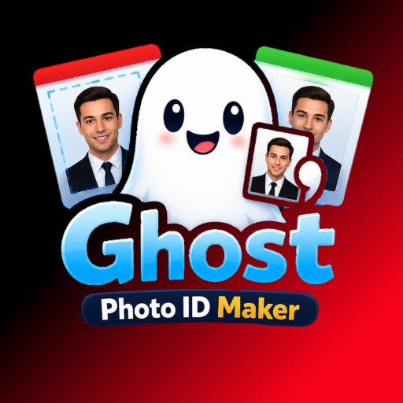
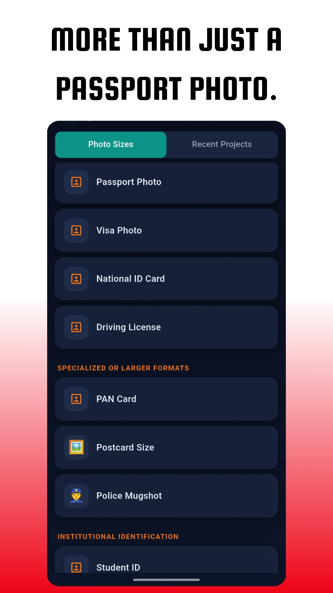
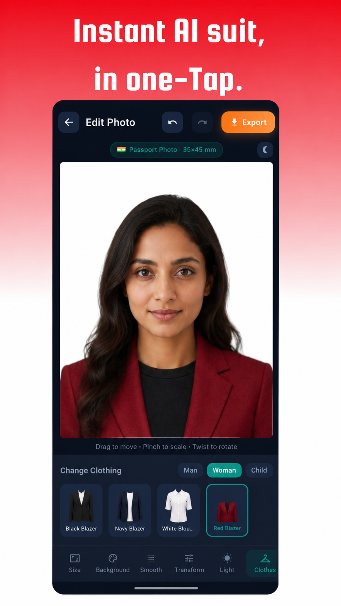
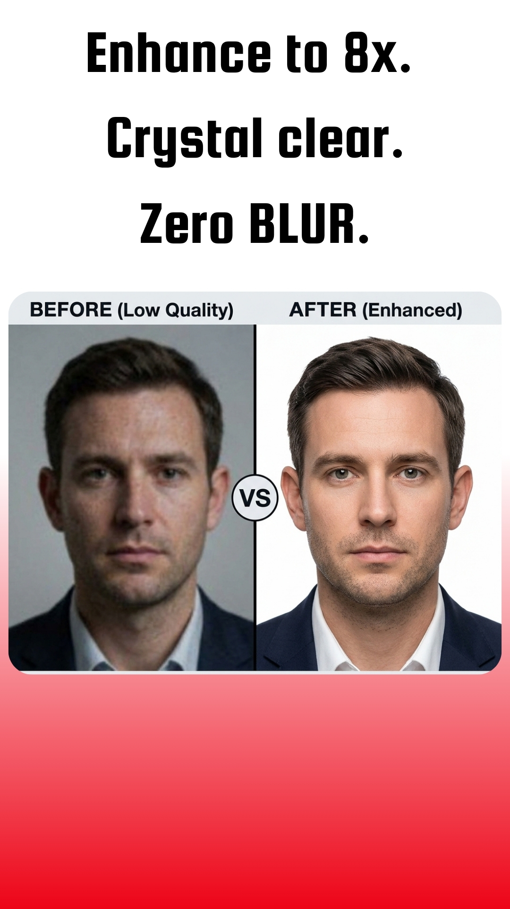
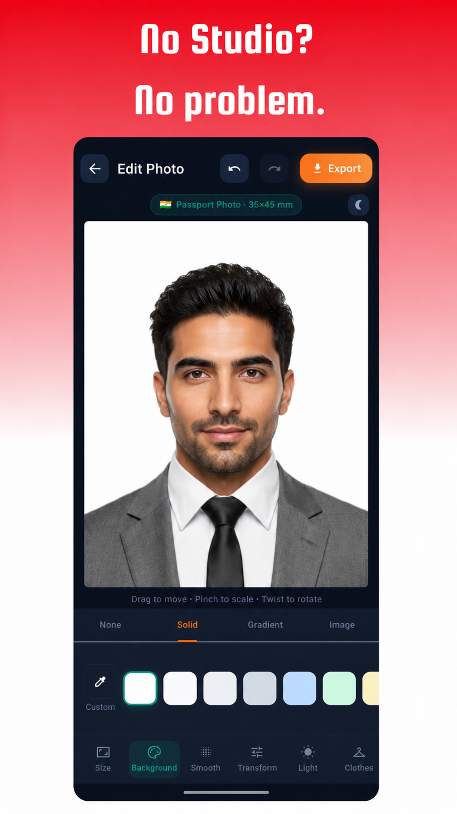
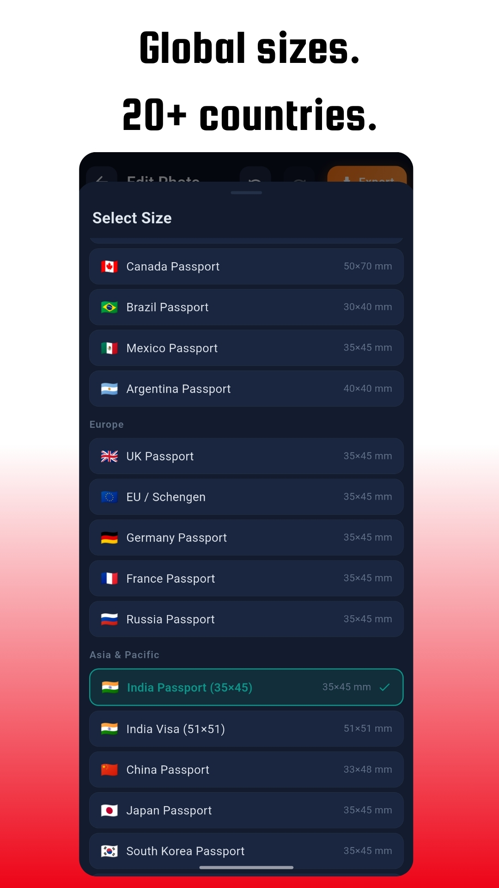

<div align="center">



# Ghost Photo ID Maker

### Fast, Intelligent, and Privacy-Focused Offline Passport & ID Photo Creator for All Android Screens

[](https://flutter.dev)
[](https://dart.dev)
[](https://android.com)
[](LICENSE)
[](https://buymeacoffee.com/somnathdash)

<br/>

<a href="https://buymeacoffee.com/somnathdash" target="_blank">
  
</a>

<br/><br/>

**Ghost Photo ID Maker** is a modern, high-performance Android passport and official ID photo creation suite built with Flutter. Engineered with a strict offline-first philosophy, it combines local neural background removal, formal suit swapping, lighting adjustments, and super-resolution upscaling across **smartwatches (Wear OS), phones, foldables, tablets, and Android TV**.

[Features](#-key-features) • [Screenshots](#-screenshots) • [Architecture](#-architecture--tech-stack) • [Contributions](#-contributions) • [Support](#-support--donations)

</div>

---

## 🌟 Key Features

### 🔒 100% Offline & Zero-Cloud Privacy
- **Zero Cloud Uploads**: Complete on-device processing ensures sensitive biometric and face photos never leave your device.
- **Zero Telemetry & Tracking**: 100% open-source without ads, third-party analytics, or in-app billing dependencies.
- **Local Sandboxing**: All edited projects, custom crops, and generated documents reside strictly within local device storage.

### 🧠 On-Device AI Background Removal & Replacement
- **Instant Edge Segmentation**: High-precision portrait segmentation powered by local neural networks.
- **Official Color Presets**: Switch backdrops to compliant solid colors (pure white, off-white, light blue, grey) or custom color picker palettes.
- **Gradient & Image Backdrops**: Support for dual-tone gradients, custom background photos, and transparent PNG cutouts for digital submissions.

### 👔 Smart Clothes & Suit Swapper
- **Formal Attire Studio**: Built-in collection of 12 formal suits, blazers, white shirts, and uniforms for men, women, and children.
- **Intuitive Alignment**: Fluid multi-touch scaling, translation, and rotation controls for seamless fit around shoulder contours.
- **Layer Stacking**: Visual layer management to reorder, hide, or fine-tune attire directly over segmented portraits.

### ⚡ AI Face & Detail Super-Resolution
- **Local Neural Upscaling**: Offline super-resolution upscaling powered by ONNX Runtime (`flutter_onnxruntime` with Real-ESRGAN).
- **300+ DPI Print Fidelity**: Eliminates pixelation and compression artifacts to produce ultra-sharp physical prints.
- **2× & 4× Scale Modes**: Tailored scaling factors for standard passport tiles and high-resolution exports.

### 📐 35+ Global Standards & Custom Dimensions
- **Official Country Standards**: Built-in compliant presets for USA (2×2 in), UK (35×45 mm), Schengen / EU, India, Canada, Australia, Japan, China, Brazil, UAE, and more.
- **Custom Dimensions**: Precision unit support (Millimeters and Pixels) with configurable dimensions.
- **Biometric Head Alignment**: Integrated guideline overlays indicating eye level, head crown, and chin limits.

### 🎛️ Studio Lighting & Skin Retouching
- **Lighting Controls**: Fine-tune exposure, contrast, brightness, hue, and saturation directly on portraits and backgrounds.
- **Skin Smoothing & Softening**: Adjustable smoothing filters to refine passport portraits while maintaining natural facial details.
- **Manual Brush & Eraser**: Precision manual retouching tools to perfect edges around hair and shoulders.

### 🖨️ A4 Print Grid & PDF Generation
- **Standard A4 Print Sheets**: Automatically tile multiple photo copies onto an A4 page with configurable copy counts and margins.
- **Instant PDF & Printing**: Direct Wi-Fi printer connectivity and PDF document generation powered by `pdf` and `printing`.
- **Lossless & Standard Export**: Export in PNG (lossless transparent) or JPEG (standard photo) formats.

### 📱 Full-Spectrum Adaptive UI
- Tailored for all screen configurations via dynamic breakpoint management:
  - ⌚ **Wear OS / Smartwatches** (Ultra-compact layouts and gesture controls)
  - 📱 **Smartphones & Foldables** (One-handed navigation and fluid pinch-to-zoom canvas)
  - 📟 **Tablets & Desktops** (Multi-pane adaptive layouts and expanded sidebars)
  - 📺 **Android TV** (D-Pad friendly navigation and high-resolution viewing)

### 🎨 AMOLED & Custom Themes
- **AMOLED True Black**: Maximize battery life on OLED displays with deep blacks.
- **Adaptive System Themes**: Sleek Light, Dark, and System palettes with responsive glassmorphism.

---

## 📸 Screenshots

<p align="center">
  
  
</p>
<p align="center">
  
  
</p>
<p align="center">
  
</p>

---

## 🏗 Architecture & Tech Stack

```
passport_maker/
├── android/                 # Native Android configuration & ProGuard rules
├── assets/                  # Clothes attire assets, ONNX neural models, showcase art
├── LOGO/                    # Branding logos, responsive launcher icons, screenshots
├── lib/
│   ├── config/              # Centralized URLs and ecosystem links (AppUrls)
│   ├── models/              # Passport size definitions, background and layer models
│   ├── screens/             # Home, Crop/Rotate, Editor, Settings, and Share screens
│   ├── services/            # Background remover, super resolution, export & responsive helpers
│   ├── theme/               # Design tokens, gradients, and theme palettes
│   ├── utils/               # Image conversion and manifest helpers
│   └── widgets/             # FollowUs dialog, canvas, export sheet, and gallery widgets
└── test/                    # Unit and widget tests
```

| Layer | Technology |
|---|---|
| **Framework** | [Flutter](https://flutter.dev) (Dart 3.x) |
| **On-Device AI Segmentation** | `image_background_remover` |
| **Super-Resolution Upscaling** | `flutter_onnxruntime` (ONNX Runtime) |
| **Image Processing** | `image` (Native Dart image manipulation) |
| **Document Export & Printing** | `pdf` & `printing` |
| **Persistence** | `shared_preferences` |
| **System & Links** | `url_launcher`, `share_plus` |

---

## 🤝 Contributions

Contributions, bug reports, and feature requests are welcome! Feel free to check the [issues page](https://github.com/sddev7/Ghost-Photo-ID-Maker/issues) or submit a pull request.

### Prerequisites & Setup
- [Flutter SDK](https://docs.flutter.dev/get-started/install) (`^3.11.5` or higher)
- [Android Studio](https://developer.android.com/studio) or VS Code with Flutter extensions
- Android SDK (API 24 or newer recommended)

### How to Contribute

1. **Fork the repository**
2. **Clone your fork:**
   ```bash
   git clone https://github.com/sddev7/Ghost-Photo-ID-Maker.git
   cd Ghost-Photo-ID-Maker
   ```
3. **Install dependencies:**
   ```bash
   flutter pub get
   ```
4. **Create a feature branch:**
   ```bash
   git checkout -b feature/amazing-feature
   ```
5. **Commit your changes:**
   ```bash
   git commit -m "feat: add amazing feature"
   ```
6. **Push to the branch:**
   ```bash
   git push origin feature/amazing-feature
   ```
7. **Open a Pull Request**

---

## ☕ Support & Donations

If Ghost Photo ID Maker helps you create passport and official photos easily or saves you time, consider supporting the development! Your support keeps this project active, open-source, and constantly improving.

<div align="center">

<a href="https://buymeacoffee.com/somnathdash" target="_blank">
  
</a>

<br/><br/>

[](https://github.com/sddev7/Ghost-Photo-ID-Maker)
&nbsp;
[](https://play.google.com/store/apps/dev?id=5205870768278368922)
&nbsp;
[](https://x.com/SDdev__)
&nbsp;
[](https://www.instagram.com/sddev_)

<br/><br/>

[🔒 Privacy Policy](https://ghosteco.sddev.in/apps/ghost-passport-maker/privacy/) • [💬 Feedback & Bug Report](https://ghosteco.sddev.in/feedback/?app=ghost-passport-maker)

</div>

---

## 📄 License

This project is licensed under the [GNU General Public License v3.0](LICENSE) - see the [LICENSE](LICENSE) file for details.

<div align="center">
  <sub>Crafted with care by <a href="https://github.com/somnathdashs">Somnath Dash (SD Dev)</a> for the Ghost Ecosystem.</sub>
</div>